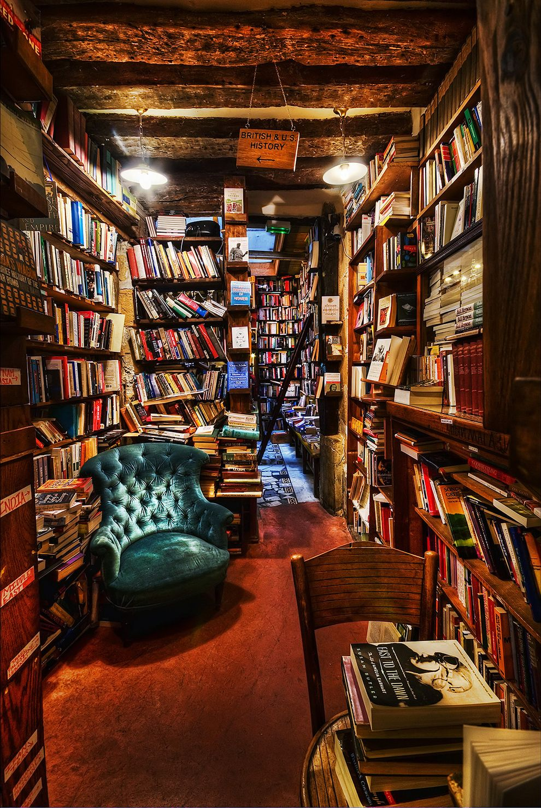

# My First Coding Assignment

## About Me ##
My name is Alex and as you can tell by the selected image I really enjoy reading and learning new things; something that I will be putting to practice this semester. I also enjoy travel and spending time with family. Currently, I'm on my last year of the Global Strategic Communications Program and am looking to combine it with a certificate in Web Design. That's why I'm here!
### Past Coding Experience ###
I have zero coding experience. I'm looking forward to gaining some new skills.
#### Career Goals ####
It is my goal to find a career where I am able to implement all my skills and knowledge and that allows me to continue to grow and expand those skills. I'm currently working towards furthering my career in public relations but my dream job would be working in communications for a book publisher.
